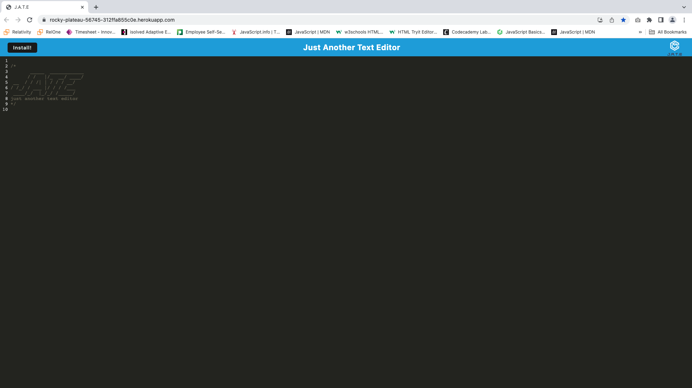
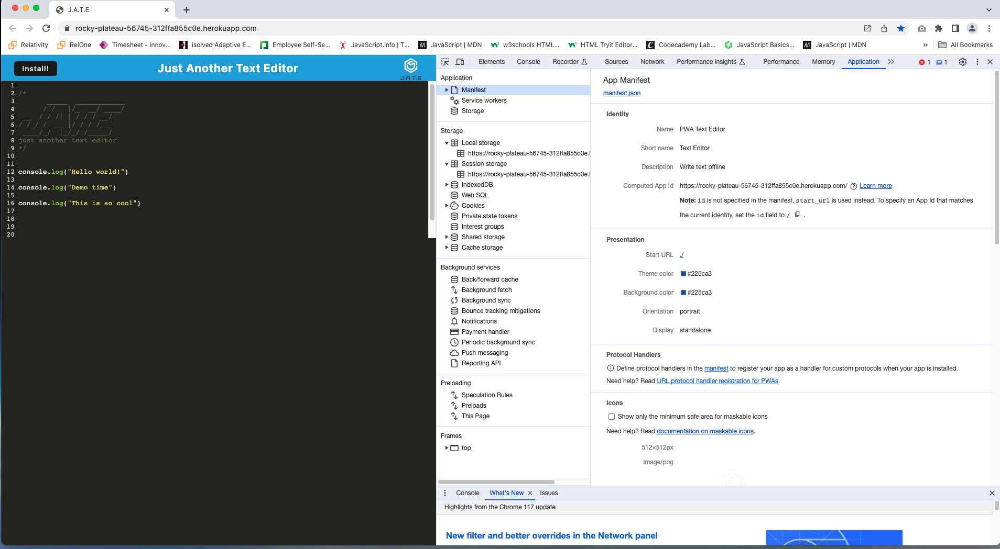

# PWA-Text-Editor

### Table of Contents
1. [Description](#description)
2. [Installation](#installation)
3. [Technologies](#technologies) 
4. [Usage](#usage)
5. [Images](#images)
6. [Contributing](#contributing)
7. [Collaborators](#collaborators)
8. [Questions](#questions)
9. [License](#license)
10. [Project URL](#project-url)

### Description

This is a PWA text editor that allows users to create and edit text files offline. It is designed to be fast, lightweight, and easy to use.

### Technologies

This project utilizes the following technologies:

- HTML
- CSS
- JavaScript
- Node.js
- Express.js
- MongoDB
- Mongoose
- Service Workers

### Installation

To install this project, follow these steps:

1. Clone the repository to your local machine.
2. Install the necessary dependencies using `npm install`.
3. Start the server using `npm start`.

### Usage

To use this project, follow these steps:

1. Open the app in your web browser.
2. Create a new text file or open an existing one.
3. Edit the text file as desired.
4. Save the text file to your device.

### Images

### Contributing

Contributions to this project are currently not being accepted. If you would like to contribute, please contact me at the email listed below.

### Collaborators

This project was completed with guidance and assistance from EdX/UC Berkeley Extension tutor, Robby Kurle.

### Questions

If you have any questions, please contact me:

- GitHub: [Augustus1110](https://github.com/Augustus1110)
- Email: donahi22@gmail.com

### License

This project is licensed under the [MIT License](https://opensource.org/licenses/MIT).

### Project URL

https://rocky-plateau-56745-312ffa855c0e.herokuapp.com/